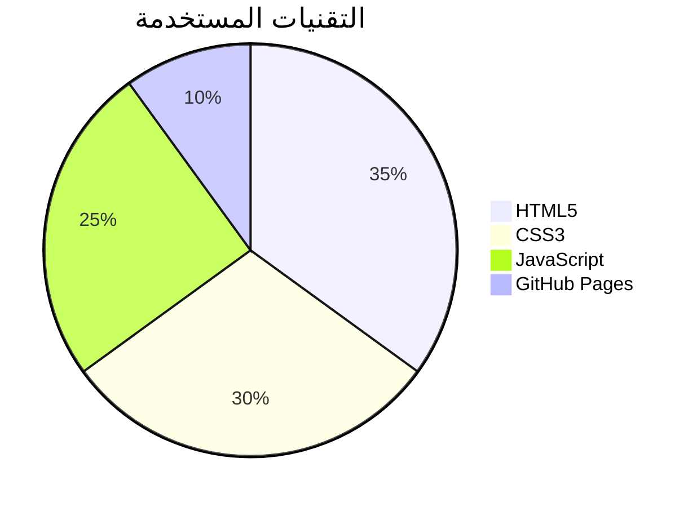
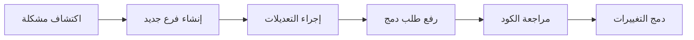

---

---
#                                                                                                           # اهــــــــــــــــــــــــــــــــــلا بك


---
## نبذة عن المشروع 
 ده *بورتفوليو شخصي*، الهدف منه إنك تعرض شغلك في أي مجال بتشتغل فيه، سواء كان تصميم جرافيكي، برمجة، تسويق رقمي، أو أي مجال آخر. البورتفوليو ده معمول بشكل بسيط لكن احترافي علشان الناس تشوف شغلك بأبسط طريقة. هتشارك فيه كل حاجة جديدة بتعملها وأي مشروع حاسس إنه مهم أو هيفيد الناس بشكل مجاني.
<details>
  <summary>تحسين محركات البحث (SEO)</summary>
  <p>الموقع متوافق مع معايير SEO، مما يعزز ظهوره في محركات البحث ويزيد من فرص ظهوره في نتائج البحث.</p>
</details>

<details>
  <summary>سرعة الموقع</summary>
  <p>تم تحسين سرعة تحميل الصفحات والملفات، مما يوفر تجربة مستخدم أسرع وأفضل على جميع الأجهزة.</p>
</details>

<details>
  <summary>التنسيق والتصميم المتجاوب</summary>
  <p>تصميم عصري ومتجاوب يتناسب مع جميع الأجهزة (موبايل، تابلت، لابتوب) لضمان تجربة تصفح مريحة.</p>
</details>

<details>
  <summary>مميزات تفاعلية جديدة</summary>
  <p>يتضمن الموقع ميزات تفاعلية ورسوم متحركة تضيف لمسة حديثة للمحتوى وتزيد من جذب الزوار.</p>
</details>

<details>
  <summary>سهولة التحديث والصيانة</summary>
  <p>واجهة بسيطة وسهلة التحديث، تتيح لك إضافة مشاريع جديدة أو تعديل المحتوى بسهولة.</p>
</details>

<details>
  <summary>أمان الموقع</summary>
  <p>الموقع يعتمد على أحدث بروتوكولات الأمان لحماية بيانات الزوار وضمان تجربة تصفح آمنة.</p>
</details>


---

## التقنيات المستخدمة  
- **HTML5** لإنشاء الهيكل العام  
- **CSS3** لتنسيق وتحسين التصميم  
- **JavaScript** لإضافة التفاعلية  
- **GitHub Pages** لنشر الموقع  



---

## هيكلة المشروع  

```
📂 arsinek-portfolio
├── 📜 index.html    # الصفحة الرئيسية
└── 📜 README.md     # ملف التوثيق
```

---

## كيفية نشر المشروع على GitHub Pages  
لنشر المشروع عبر **GitHub Pages**، اتبع الخطوات التالية:  

1. انتقل إلى مستودع المشروع على GitHub  
2. افتح **Settings** (الإعدادات)  
3. اختر **Pages** من القائمة الجانبية  
4. في قسم **Source**، حدد الفرع `main` ثم اضغط "Save"  
5. سيتم إنشاء رابط مباشر للموقع، يمكنك الوصول إليه عبر:  
   [ https://kl0l69.github.io/arsinek-portfolio/ ]

---

## كيفية المساهمة  
للمساهمة في تحسين المشروع، يمكنك اتباع الخطوات التالية:  



### خطوات المساهمة:  
1. افتح **Issue** جديد في المستودع  
2. أنشئ **Branch** جديد للعمل على التعديلات  
3. أجرِ التعديلات ورفعها عبر **Commit & Push**  
4. افتح **Pull Request** مع وصف واضح للتعديلات  
5. سيتم مراجعة التعديلات ودمجها في المشروع  

---

## المشاهدات  
<div align="center">
  
</div>

---

## شروط استخدام البورتفوليو المجاني  

### 1. الاستخدام الشخصي فقط
البورتفوليو ده معمول لعرض شغلك الشخصي. **ممنوع تبيعه، تأجره، أو تعيد توزيعه** كقالب لأي حد تاني.

> قال الله تعالى: "وَلَا تَأْكُلُوا أَمْوَالَكُمْ بَيْنَكُمْ بِالْبَاطِلِ" (البقرة: 188).

### 2. عدم إزالة الحقوق
ممنوع تمسح اسمي كمطور أو مصمم من أي جزء في البورتفوليو، إلا لو أخذت إذن مني. لو حابب نسخة مخصصة بدون الحقوق، ممكن نتفق على ده.

> قال الله تعالى: "وَلَا تَبْخَسُوا النَّاسَ أَشْيَاءَهُمْ" (الأعراف: 85).

### 3. التعديلات مسموحة بشرط
مسموح لك تعدل في التصميم، الألوان، النصوص، والصور، لكن **ممنوع تنشره كأنه شغلك الخاص** أو تبيعه للناس.

> قال النبي ﷺ: "مَنْ غَشَّنَا فَلَيْسَ مِنَّا" (حديث صحيح).

### 4. مفيش دعم فني كامل
البورتفوليو **مجاني تمامًا**، يعني مش هقدملك دعم فني بشكل كامل. لكن لو عندك مشكلة بسيطة، أنا هساعدك فيها على قد ما أقدر.

> قال الله تعالى: "لَا يُكَلِّفُ اللَّهُ نَفْسًا إِلَّا وُسْعَهَا" (البقرة: 286).

### 5. الالتزام بالضوابط الشرعية والأخلاقية
لازم تستخدم البورتفوليو ده في الحلال وبما يرضي الله:

- لو أنت **جرافيك ديزاينر**، حاول تبعد عن الصور الغير لائقة.
- لو أنت **كتّاب محتوى**، خلي المحتوى صادق وأخلاقي.
- لو بتشتغل في **البرمجة أو التسويق**، خلي شغلك مفيد وبدون استغلال.

> قال الله تعالى: "قُل لِّلْمُؤْمِنِينَ يَغُضُّوا مِنْ أَبْصَارِهِمْ وَيَحْفَظُوا فُرُوجَهُمْ" (النور: 30).

### 6. عدم استخدامه في أنشطة مخالفة
ممنوع تستخدم البورتفوليو في أي حاجة مخالفة:

- مواقع أو أنشطة احتيالية
- الترويج لمنتجات أو خدمات غير قانونية
- أي محتوى يتضمن غش أو استغلال

> قال الله تعالى: "وَلَا تَعَاوَنُوا عَلَى الْإِثْمِ وَالْعُدْوَانِ" (المائدة: 2).

### 7. تعديل الشروط حسب الحاجة
ممكن أعدل الشروط من وقت لآخر حسب الحاجة، وأنا هبلغك بأي تغييرات مهمة.

> قال الله تعالى: "وَأَوْفُوا بِالْعَهْدِ إِنَّ الْعَهْدَ كَانَ مَسْؤُولًا" (الإسراء: 34).

---

## ملاحظات إضافية

- **البورتفوليو** معمول علشان يعرض شغلك بشكل احترافي. خلي بالك إنك تستخدمه بالشكل الصحيح.
- لو عندك أي أسئلة أو حابب تواصل معايا، دي طرق التواصل:

## 📬 **Connect With Me**
<p align="center">
  <a href="https://github.com/kl0l69"></a>
  <a href="https://www.facebook.com/nq703"></a>
  <a href="mailto:ayrn194@gmail.com"></a>
  <a href="https://t.me/nq703"></a>
  <a href="https://instagram.com/kl0l69"></a>
  <a href="https://wa.me/+201141345223"></a>
</p>

---

# شكراً لك على استخدام البورتفوليو q(≧▽≦q)
## 📊 **Profile Insights & Extras**


<p align="center">
  
</p>

---

## ❤️ **Thank u For Visiting!**

<p align="center">
  
</p>

---

